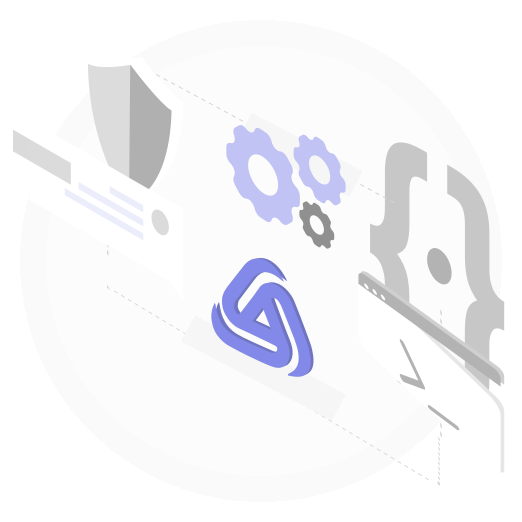
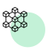
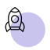

---
hide:
  - navigation
  - toc
---
<!DOCTYPE html>
<html lang="en">
<head>
    <meta charset="UTF-8">
    <meta name="viewport" content="width=device-width, initial-scale=1.0">
    <title>Kalp Studio Landing Page</title>
    <link rel="preconnect" href="https://fonts.googleapis.com">
    <link rel="preconnect" href="https://fonts.gstatic.com" crossorigin>
    <link href="https://fonts.googleapis.com/css2?family=Source+Sans+3:ital,wght@0,200..900;1,200..900&display=swap" rel="stylesheet">    <link rel="stylesheet" href="https://fonts.googleapis.com/icon?family=Material+Icons">
    <link rel="stylesheet" href="https://cdnjs.cloudflare.com/ajax/libs/octicons/8.5.0/build.css">
    
</head>
<body>
    <header class="header-main-wrapper">
        

         <h1>Simplify Web 3.0 development with the Kalp studio documentation!</h1>
                

                Dive headfirst into Web 3.0 development with Kalp Studio! Our user-friendly documentation equips you with everything you need to unlock the potential of the Kalp Blockchain.
                 
                 
                Kalp studio empowers developers of all skill levels to navigate the exciting realm of Web 3.0 development using the robust Kalp Blockchain. It leverages a low-code approach, enabling both beginners and seasoned Web 2.0 developers to effortlessly create cutting-edge Web 3.0 applications or seamlessly extend existing applications into the decentralized world.
                

        

       
    </header>
          

                

                      

                         
                          

                             <h4>
                               Build
                             </h4>
                             
                                 Getting started & Building with Kalp Studio.
                              
                          

                      

                  

                    

                        

                            Onboarding
                            <svg width="16" height="16" viewBox="0 0 16 16" fill="none" xmlns="http://www.w3.org/2000/svg">
                            <path d="M12.8923 4.99995L11.0622 11.8301L9.10644 11.3426L10.0581 7.79098L3 11.866L2 10.1339L9.05811 6.05893L5.50644 5.10726L6.06218 3.16982L12.8923 4.99995Z" fill="black"/>
                            </svg>
                        

                        
                        Start your blockchain journey with our seamless onboarding process designed to get you up and running in no time. KALP Studio provides a user-friendly interface that guides you through every step, ensuring a hassle-free setup.
                        
                    

                     

                        

                            Dashboard
                            <svg width="16" height="16" viewBox="0 0 16 16" fill="none" xmlns="http://www.w3.org/2000/svg">
                            <path d="M12.8923 4.99995L11.0622 11.8301L9.10644 11.3426L10.0581 7.79098L3 11.866L2 10.1339L9.05811 6.05893L5.50644 5.10726L6.06218 3.16982L12.8923 4.99995Z" fill="black"/>
                            </svg>
                        

                        
                        The KALP Studio Dashboard provides an all-in-one overview of your blockchain projects, giving you real-time insights and control over your operations.
                        
                    

                     

                        

                            Smart Contract Management
                            <svg width="16" height="16" viewBox="0 0 16 16" fill="none" xmlns="http://www.w3.org/2000/svg">
                            <path d="M12.8923 4.99995L11.0622 11.8301L9.10644 11.3426L10.0581 7.79098L3 11.866L2 10.1339L9.05811 6.05893L5.50644 5.10726L6.06218 3.16982L12.8923 4.99995Z" fill="black"/>
                            </svg>
                        

                        
                        KALP Studio simplifies the process of writing, deploying, and managing smart contracts, making it accessible to both beginners and experienced developers.
                        
                    

                     

                        

                            Wallet Management
                            <svg width="16" height="16" viewBox="0 0 16 16" fill="none" xmlns="http://www.w3.org/2000/svg">
                            <path d="M12.8923 4.99995L11.0622 11.8301L9.10644 11.3426L10.0581 7.79098L3 11.866L2 10.1339L9.05811 6.05893L5.50644 5.10726L6.06218 3.16982L12.8923 4.99995Z" fill="black"/>
                            </svg>
                        

                        
                        Manage your digital assets effortlessly with KALP Studio's comprehensive wallet management features.
                        
                    

                     

                        

                            API Gateway Management
                            <svg width="16" height="16" viewBox="0 0 16 16" fill="none" xmlns="http://www.w3.org/2000/svg">
                            <path d="M12.8923 4.99995L11.0622 11.8301L9.10644 11.3426L10.0581 7.79098L3 11.866L2 10.1339L9.05811 6.05893L5.50644 5.10726L6.06218 3.16982L12.8923 4.99995Z" fill="black"/>
                            </svg>
                        

                        
                        KALP Studio's API Gateway Management simplifies the process of generating and managing API endpoints for your smart contracts.
                        
                    

                     

                        

                            Transaction Monitoring
                            <svg width="16" height="16" viewBox="0 0 16 16" fill="none" xmlns="http://www.w3.org/2000/svg">
                            <path d="M12.8923 4.99995L11.0622 11.8301L9.10644 11.3426L10.0581 7.79098L3 11.866L2 10.1339L9.05811 6.05893L5.50644 5.10726L6.06218 3.16982L12.8923 4.99995Z" fill="black"/>
                            </svg>
                        

                        
                        Stay on top of your blockchain transactions with KALP Studio's advanced transaction monitoring tools.
                        
                    

                    

                        

                            Settings
                            <svg width="16" height="16" viewBox="0 0 16 16" fill="none" xmlns="http://www.w3.org/2000/svg">
                            <path d="M12.8923 4.99995L11.0622 11.8301L9.10644 11.3426L10.0581 7.79098L3 11.866L2 10.1339L9.05811 6.05893L5.50644 5.10726L6.06218 3.16982L12.8923 4.99995Z" fill="black"/>
                            </svg>
                        

                        
                        Tailor your KALP Studio environment to meet your specific needs with our extensive settings options.
                        
                    

                    

                        

                            Subscription
                            <svg width="16" height="16" viewBox="0 0 16 16" fill="none" xmlns="http://www.w3.org/2000/svg">
                            <path d="M12.8923 4.99995L11.0622 11.8301L9.10644 11.3426L10.0581 7.79098L3 11.866L2 10.1339L9.05811 6.05893L5.50644 5.10726L6.06218 3.16982L12.8923 4.99995Z" fill="black"/>
                            </svg>
                        

                        
                        Choose from a variety of subscription plans designed to fit your needs and scale with your growth.
                        
                    

              

        

               

                     

                        
                         

                            <h4>
                              Learn
                            </h4>
                            
                                Further your understanding of entire kalp studio ecosystem.
                             
                         

                     

                 

                    

                           

                               Kalp studio overview
                               <svg width="16" height="16" viewBox="0 0 16 16" fill="none" xmlns="http://www.w3.org/2000/svg">
                               <path d="M12.8923 4.99995L11.0622 11.8301L9.10644 11.3426L10.0581 7.79098L3 11.866L2 10.1339L9.05811 6.05893L5.50644 5.10726L6.06218 3.16982L12.8923 4.99995Z" fill="black"/>
                               </svg>
                           

                           
                                 Kalp Studio empowers developers of all skill levels to navigate the exciting realm of Web 3.0 development using the robust Kalptantra Blockchain. It leverages a low-code approach, enabling both beginners and seasoned Web 2.0 developers to effortlessly create cutting-edge Web 3.0 applications or seamlessly extend existing applications into the decentralized world.
                            
                       

                        

                           

                               Kalp studio ecosystem
                               <svg width="16" height="16" viewBox="0 0 16 16" fill="none" xmlns="http://www.w3.org/2000/svg">
                               <path d="M12.8923 4.99995L11.0622 11.8301L9.10644 11.3426L10.0581 7.79098L3 11.866L2 10.1339L9.05811 6.05893L5.50644 5.10726L6.06218 3.16982L12.8923 4.99995Z" fill="black"/>
                               </svg>
                           

                            
                               The KALP Studio ecosystem is a suite of interconnected products, each tailored to specific aspects of blockchain development and management. Together, it provide a seamless experience for building, managing, and scaling blockchain projects. KALP Studio Console is Your central hub for accessing and managing all KALP Studio services. Token Studio Simplifies the process of creating and managing custom tokens with our easy-to-use tools. Wallet Management Securely manages your digital assets across multiple blockchain networks. KALP Instant Deployer Efficiently write, deploy, and manage smart contracts with our high-performance system. Additional tools are for managing subscriptions, generating API keys, and monitoring transactions.
                          
                       

                    

                       

                           Kalp blockchain
                           <svg width="16" height="16" viewBox="0 0 16 16" fill="none" xmlns="http://www.w3.org/2000/svg">
                           <path d="M12.8923 4.99995L11.0622 11.8301L9.10644 11.3426L10.0581 7.79098L3 11.866L2 10.1339L9.05811 6.05893L5.50644 5.10726L6.06218 3.16982L12.8923 4.99995Z" fill="black"/>
                           </svg>
                       

                        
                           The Kalp Decentralized Network (KDN) is a meticulously designed hybrid cross-chain ecosystem that prioritizes secure and compliant tokenization of real-world assets (RWAs). KDN leverages KYC verification and a Distributed Certificate Authority (DCA) to establish a trustworthy environment. High-performance Byzantine Fault Tolerance (BFT) also known as SMART-BFT algorithms ensures optimal transaction processing and consensus across networks.
                           Key to Kalps proposition is its cross-chain interoperability, facilitated by a comprehensive gateway and Oracle layer protocols, ensuring fluid communication and data integration across blockchain landscapes. The Cross-Chain Layer bridges Kalp with external networks, enhancing the liquidity and market reach of tokenized assets. Kalp decentralized network (KDN) establishing itself as a comprehensive ecosystem driving the future of regulated asset tokenization and cross-chain functionality, all underpinned by the core principles of decentralized peer-to-peer (P2P) blockchain technology.
                           Positioning itself as a pivotal player in the blockchain space, Kalps Asset Tokenization, called Kalpify, provides a transparent, compliant pathway for transforming RWAs into digital tokens. This opens new avenues for asset management and investment, redefining asset liquidity and accessibility in the modern digital era. 
                      
                   

                       

                         

                             What is API Gateway
                             <svg width="16" height="16" viewBox="0 0 16 16" fill="none" xmlns="http://www.w3.org/2000/svg">
                             <path d="M12.8923 4.99995L11.0622 11.8301L9.10644 11.3426L10.0581 7.79098L3 11.866L2 10.1339L9.05811 6.05893L5.50644 5.10726L6.06218 3.16982L12.8923 4.99995Z" fill="black"/>
                             </svg>
                         

                          
                             The API Gateway in KALP Studio simplifies the process of generating and managing API endpoints for your smart contracts, providing a powerful integration point for your blockchain applications.
                        
                     

                   

                

             

             

                    

                        <h1>
                         Developer Resources
                        </h1>
                        
                        For developers who know what they want to build and are ready to go.
                        
                    

                    

                        

                        

                            

                                 
                                 <h4>Kalp SDK</h4>
                                The Kalp SDK provides a robust set of tools and functionalities designed to streamline your development journey. Whether you're a seasoned blockchain developer or just starting your Web 3.0 exploration, the Kalp SDK offers a comprehensive solution to simplify building, deploying, and managing your decentralized applications (DApps).
                            

                            

                                
                                <h4>KRC Token standard</h4>
                               KRC token standards serve as the foundation for creating a thriving and interoperable tokenized ecosystem on the Kalp blockchain. By adhering to these standards, developers can build tokens that seamlessly integrate with various applications and services, fostering a vibrant environment of innovation and diverse functionalities.
                           

                           

                               
                               <h4>Write, Test, Deploy & Interact</h4>
                              Welcome to your comprehensive guide on building the backbone of decentralized applications – smart contracts. This guide empowers you to take control, from the initial spark of an idea to a fully-fledged blockchain implementation.
                            

                        

                    

             

                 <h1>Quick Start</h1>
                 
                 Are you ready to start building?
                 
                 

                     

                         

                         <svg width="20" height="19" viewBox="0 0 20 19" fill="none" xmlns="http://www.w3.org/2000/svg">
                          <path d="M15.642 18.6161C15.7632 18.5084 15.8814 18.3946 16.0057 18.2885C17.5652 16.9706 18.082 15.1705 17.3743 13.246C17.1015 12.509 16.7044 11.8099 16.3073 11.1244C15.4904 9.71704 14.6417 8.3279 13.7975 6.93572C13.308 6.13044 12.6488 5.80591 12.0001 6.03035C11.603 6.16684 11.453 6.35186 11.703 6.79013C12.87 8.83745 13.9309 10.95 15.1813 12.9442C16.5362 15.1068 15.4056 18.2582 12.4881 18.4826C9.6146 18.704 6.69714 18.5857 3.81606 18.3855C2.0671 18.2642 0.621252 17.3376 0.139303 15.4571C-0.163809 14.2742 0.0514004 13.1186 0.556083 11.9145C0.625799 12.0935 0.68339 12.189 0.701576 12.2936C1.07137 14.5381 2.49903 16.0728 4.74813 16.2033C7.15787 16.3443 9.58429 16.223 12.0046 16.1744C12.6093 16.1623 13.1352 15.8636 13.3065 15.2069C13.4156 14.7868 13.3899 14.4668 12.7852 14.4653C10.4709 14.4592 8.15056 14.3152 5.84085 14.4062C2.94612 14.5245 1.06228 11.6703 2.40658 9.01034C3.55538 6.73706 4.9497 4.58813 6.24096 2.38764C6.35917 2.18594 6.51831 2.00547 6.67289 1.82652C8.92653 -0.765232 11.9364 -0.596897 13.984 2.3194C13.7672 2.24964 13.6263 2.21324 13.4899 2.15864C11.606 1.42616 9.74342 1.87354 8.41427 3.40068C8.12026 3.73887 7.84442 4.10132 7.61709 4.48804C6.60621 6.20779 5.612 7.93663 4.6193 9.667C4.17979 10.4298 4.17828 11.1623 4.59051 11.6567C5.04215 12.2011 5.39527 12.1738 5.74385 11.5687C6.88962 9.58056 8.11419 7.63181 9.16448 5.59359C10.5088 2.98667 14.04 2.85928 15.645 5.41312C16.9226 7.44528 18.0851 9.55478 19.2233 11.6673C19.5915 12.3497 19.8128 13.1474 19.9341 13.9194C20.2417 15.856 19.4688 17.2785 17.6986 18.1065C17.0712 18.4007 16.3801 18.5524 15.7163 18.7692C15.692 18.7177 15.6708 18.6646 15.6465 18.613L15.6465 18.6161L15.642 18.6161ZM10.048 8.6949C9.3812 9.85353 8.76134 10.9288 8.1051 12.0677L11.9865 12.0677C11.3302 10.9272 10.7164 9.8596 10.0465 8.6949L10.048 8.6949Z" fill="#D1D4D6"/>
                         </svg>
                         

                         

                            Create an account and KYC on Kalp Studio
                             <svg width="16" height="16" viewBox="0 0 16 16" class="arrow-wrapper" fill="none" xmlns="http://www.w3.org/2000/svg">
                             <path d="M12.8923 4.99995L11.0622 11.8301L9.10644 11.3426L10.0581 7.79098L3 11.866L2 10.1339L9.05811 6.05893L5.50644 5.10726L6.06218 3.16982L12.8923 4.99995Z" fill="black"/>
                             </svg>
                         

                     

                     

                         

                         <svg width="20" height="19" viewBox="0 0 20 19" fill="none" xmlns="http://www.w3.org/2000/svg">
                          <path d="M15.642 18.6161C15.7632 18.5084 15.8814 18.3946 16.0057 18.2885C17.5652 16.9706 18.082 15.1705 17.3743 13.246C17.1015 12.509 16.7044 11.8099 16.3073 11.1244C15.4904 9.71704 14.6417 8.3279 13.7975 6.93572C13.308 6.13044 12.6488 5.80591 12.0001 6.03035C11.603 6.16684 11.453 6.35186 11.703 6.79013C12.87 8.83745 13.9309 10.95 15.1813 12.9442C16.5362 15.1068 15.4056 18.2582 12.4881 18.4826C9.6146 18.704 6.69714 18.5857 3.81606 18.3855C2.0671 18.2642 0.621252 17.3376 0.139303 15.4571C-0.163809 14.2742 0.0514004 13.1186 0.556083 11.9145C0.625799 12.0935 0.68339 12.189 0.701576 12.2936C1.07137 14.5381 2.49903 16.0728 4.74813 16.2033C7.15787 16.3443 9.58429 16.223 12.0046 16.1744C12.6093 16.1623 13.1352 15.8636 13.3065 15.2069C13.4156 14.7868 13.3899 14.4668 12.7852 14.4653C10.4709 14.4592 8.15056 14.3152 5.84085 14.4062C2.94612 14.5245 1.06228 11.6703 2.40658 9.01034C3.55538 6.73706 4.9497 4.58813 6.24096 2.38764C6.35917 2.18594 6.51831 2.00547 6.67289 1.82652C8.92653 -0.765232 11.9364 -0.596897 13.984 2.3194C13.7672 2.24964 13.6263 2.21324 13.4899 2.15864C11.606 1.42616 9.74342 1.87354 8.41427 3.40068C8.12026 3.73887 7.84442 4.10132 7.61709 4.48804C6.60621 6.20779 5.612 7.93663 4.6193 9.667C4.17979 10.4298 4.17828 11.1623 4.59051 11.6567C5.04215 12.2011 5.39527 12.1738 5.74385 11.5687C6.88962 9.58056 8.11419 7.63181 9.16448 5.59359C10.5088 2.98667 14.04 2.85928 15.645 5.41312C16.9226 7.44528 18.0851 9.55478 19.2233 11.6673C19.5915 12.3497 19.8128 13.1474 19.9341 13.9194C20.2417 15.856 19.4688 17.2785 17.6986 18.1065C17.0712 18.4007 16.3801 18.5524 15.7163 18.7692C15.692 18.7177 15.6708 18.6646 15.6465 18.613L15.6465 18.6161L15.642 18.6161ZM10.048 8.6949C9.3812 9.85353 8.76134 10.9288 8.1051 12.0677L11.9865 12.0677C11.3302 10.9272 10.7164 9.8596 10.0465 8.6949L10.048 8.6949Z" fill="#D1D4D6"/>
                         </svg>
                         

                         

                         Create, Manage & Edit Kalp Studio project
                         <svg width="16" height="16" viewBox="0 0 16 16" class="arrow-wrapper" fill="none" xmlns="http://www.w3.org/2000/svg">
                         <path d="M12.8923 4.99995L11.0622 11.8301L9.10644 11.3426L10.0581 7.79098L3 11.866L2 10.1339L9.05811 6.05893L5.50644 5.10726L6.06218 3.16982L12.8923 4.99995Z" fill="black"/>
                         </svg>
                         

                     

                     

                         

                         <svg width="20" height="19" viewBox="0 0 20 19" fill="none" xmlns="http://www.w3.org/2000/svg">
                          <path d="M15.642 18.6161C15.7632 18.5084 15.8814 18.3946 16.0057 18.2885C17.5652 16.9706 18.082 15.1705 17.3743 13.246C17.1015 12.509 16.7044 11.8099 16.3073 11.1244C15.4904 9.71704 14.6417 8.3279 13.7975 6.93572C13.308 6.13044 12.6488 5.80591 12.0001 6.03035C11.603 6.16684 11.453 6.35186 11.703 6.79013C12.87 8.83745 13.9309 10.95 15.1813 12.9442C16.5362 15.1068 15.4056 18.2582 12.4881 18.4826C9.6146 18.704 6.69714 18.5857 3.81606 18.3855C2.0671 18.2642 0.621252 17.3376 0.139303 15.4571C-0.163809 14.2742 0.0514004 13.1186 0.556083 11.9145C0.625799 12.0935 0.68339 12.189 0.701576 12.2936C1.07137 14.5381 2.49903 16.0728 4.74813 16.2033C7.15787 16.3443 9.58429 16.223 12.0046 16.1744C12.6093 16.1623 13.1352 15.8636 13.3065 15.2069C13.4156 14.7868 13.3899 14.4668 12.7852 14.4653C10.4709 14.4592 8.15056 14.3152 5.84085 14.4062C2.94612 14.5245 1.06228 11.6703 2.40658 9.01034C3.55538 6.73706 4.9497 4.58813 6.24096 2.38764C6.35917 2.18594 6.51831 2.00547 6.67289 1.82652C8.92653 -0.765232 11.9364 -0.596897 13.984 2.3194C13.7672 2.24964 13.6263 2.21324 13.4899 2.15864C11.606 1.42616 9.74342 1.87354 8.41427 3.40068C8.12026 3.73887 7.84442 4.10132 7.61709 4.48804C6.60621 6.20779 5.612 7.93663 4.6193 9.667C4.17979 10.4298 4.17828 11.1623 4.59051 11.6567C5.04215 12.2011 5.39527 12.1738 5.74385 11.5687C6.88962 9.58056 8.11419 7.63181 9.16448 5.59359C10.5088 2.98667 14.04 2.85928 15.645 5.41312C16.9226 7.44528 18.0851 9.55478 19.2233 11.6673C19.5915 12.3497 19.8128 13.1474 19.9341 13.9194C20.2417 15.856 19.4688 17.2785 17.6986 18.1065C17.0712 18.4007 16.3801 18.5524 15.7163 18.7692C15.692 18.7177 15.6708 18.6646 15.6465 18.613L15.6465 18.6161L15.642 18.6161ZM10.048 8.6949C9.3812 9.85353 8.76134 10.9288 8.1051 12.0677L11.9865 12.0677C11.3302 10.9272 10.7164 9.8596 10.0465 8.6949L10.048 8.6949Z" fill="#D1D4D6"/>
                         </svg>
                         

                         

                         Write, Test, Deploy & Interact with Kalp Studio
                         <svg width="16" height="16" viewBox="0 0 16 16" class="arrow-wrapper" fill="none" xmlns="http://www.w3.org/2000/svg">
                         <path d="M12.8923 4.99995L11.0622 11.8301L9.10644 11.3426L10.0581 7.79098L3 11.866L2 10.1339L9.05811 6.05893L5.50644 5.10726L6.06218 3.16982L12.8923 4.99995Z" fill="black"/>
                         </svg>
                         

                     

                       

                             

                             <svg width="20" height="19" viewBox="0 0 20 19" fill="none" xmlns="http://www.w3.org/2000/svg">
                              <path d="M15.642 18.6161C15.7632 18.5084 15.8814 18.3946 16.0057 18.2885C17.5652 16.9706 18.082 15.1705 17.3743 13.246C17.1015 12.509 16.7044 11.8099 16.3073 11.1244C15.4904 9.71704 14.6417 8.3279 13.7975 6.93572C13.308 6.13044 12.6488 5.80591 12.0001 6.03035C11.603 6.16684 11.453 6.35186 11.703 6.79013C12.87 8.83745 13.9309 10.95 15.1813 12.9442C16.5362 15.1068 15.4056 18.2582 12.4881 18.4826C9.6146 18.704 6.69714 18.5857 3.81606 18.3855C2.0671 18.2642 0.621252 17.3376 0.139303 15.4571C-0.163809 14.2742 0.0514004 13.1186 0.556083 11.9145C0.625799 12.0935 0.68339 12.189 0.701576 12.2936C1.07137 14.5381 2.49903 16.0728 4.74813 16.2033C7.15787 16.3443 9.58429 16.223 12.0046 16.1744C12.6093 16.1623 13.1352 15.8636 13.3065 15.2069C13.4156 14.7868 13.3899 14.4668 12.7852 14.4653C10.4709 14.4592 8.15056 14.3152 5.84085 14.4062C2.94612 14.5245 1.06228 11.6703 2.40658 9.01034C3.55538 6.73706 4.9497 4.58813 6.24096 2.38764C6.35917 2.18594 6.51831 2.00547 6.67289 1.82652C8.92653 -0.765232 11.9364 -0.596897 13.984 2.3194C13.7672 2.24964 13.6263 2.21324 13.4899 2.15864C11.606 1.42616 9.74342 1.87354 8.41427 3.40068C8.12026 3.73887 7.84442 4.10132 7.61709 4.48804C6.60621 6.20779 5.612 7.93663 4.6193 9.667C4.17979 10.4298 4.17828 11.1623 4.59051 11.6567C5.04215 12.2011 5.39527 12.1738 5.74385 11.5687C6.88962 9.58056 8.11419 7.63181 9.16448 5.59359C10.5088 2.98667 14.04 2.85928 15.645 5.41312C16.9226 7.44528 18.0851 9.55478 19.2233 11.6673C19.5915 12.3497 19.8128 13.1474 19.9341 13.9194C20.2417 15.856 19.4688 17.2785 17.6986 18.1065C17.0712 18.4007 16.3801 18.5524 15.7163 18.7692C15.692 18.7177 15.6708 18.6646 15.6465 18.613L15.6465 18.6161L15.642 18.6161ZM10.048 8.6949C9.3812 9.85353 8.76134 10.9288 8.1051 12.0677L11.9865 12.0677C11.3302 10.9272 10.7164 9.8596 10.0465 8.6949L10.048 8.6949Z" fill="#D1D4D6"/>
                             </svg>
                             

                             

                             How to manage funds in Kalp Studio
                             <svg width="16" height="16" class="arrow-wrapper" viewBox="0 0 16 16" fill="none" xmlns="http://www.w3.org/2000/svg">
                             <path d="M12.8923 4.99995L11.0622 11.8301L9.10644 11.3426L10.0581 7.79098L3 11.866L2 10.1339L9.05811 6.05893L5.50644 5.10726L6.06218 3.16982L12.8923 4.99995Z" fill="black"/>
                             </svg>
                             

                         

                       

                             

                             <svg width="20" height="19" viewBox="0 0 20 19" fill="none" xmlns="http://www.w3.org/2000/svg">
                              <path d="M15.642 18.6161C15.7632 18.5084 15.8814 18.3946 16.0057 18.2885C17.5652 16.9706 18.082 15.1705 17.3743 13.246C17.1015 12.509 16.7044 11.8099 16.3073 11.1244C15.4904 9.71704 14.6417 8.3279 13.7975 6.93572C13.308 6.13044 12.6488 5.80591 12.0001 6.03035C11.603 6.16684 11.453 6.35186 11.703 6.79013C12.87 8.83745 13.9309 10.95 15.1813 12.9442C16.5362 15.1068 15.4056 18.2582 12.4881 18.4826C9.6146 18.704 6.69714 18.5857 3.81606 18.3855C2.0671 18.2642 0.621252 17.3376 0.139303 15.4571C-0.163809 14.2742 0.0514004 13.1186 0.556083 11.9145C0.625799 12.0935 0.68339 12.189 0.701576 12.2936C1.07137 14.5381 2.49903 16.0728 4.74813 16.2033C7.15787 16.3443 9.58429 16.223 12.0046 16.1744C12.6093 16.1623 13.1352 15.8636 13.3065 15.2069C13.4156 14.7868 13.3899 14.4668 12.7852 14.4653C10.4709 14.4592 8.15056 14.3152 5.84085 14.4062C2.94612 14.5245 1.06228 11.6703 2.40658 9.01034C3.55538 6.73706 4.9497 4.58813 6.24096 2.38764C6.35917 2.18594 6.51831 2.00547 6.67289 1.82652C8.92653 -0.765232 11.9364 -0.596897 13.984 2.3194C13.7672 2.24964 13.6263 2.21324 13.4899 2.15864C11.606 1.42616 9.74342 1.87354 8.41427 3.40068C8.12026 3.73887 7.84442 4.10132 7.61709 4.48804C6.60621 6.20779 5.612 7.93663 4.6193 9.667C4.17979 10.4298 4.17828 11.1623 4.59051 11.6567C5.04215 12.2011 5.39527 12.1738 5.74385 11.5687C6.88962 9.58056 8.11419 7.63181 9.16448 5.59359C10.5088 2.98667 14.04 2.85928 15.645 5.41312C16.9226 7.44528 18.0851 9.55478 19.2233 11.6673C19.5915 12.3497 19.8128 13.1474 19.9341 13.9194C20.2417 15.856 19.4688 17.2785 17.6986 18.1065C17.0712 18.4007 16.3801 18.5524 15.7163 18.7692C15.692 18.7177 15.6708 18.6646 15.6465 18.613L15.6465 18.6161L15.642 18.6161ZM10.048 8.6949C9.3812 9.85353 8.76134 10.9288 8.1051 12.0677L11.9865 12.0677C11.3302 10.9272 10.7164 9.8596 10.0465 8.6949L10.048 8.6949Z" fill="#D1D4D6"/>
                             </svg>
                             

                             

                             View & Edit kalp studio settings
                                 <svg width="16" height="16" class="arrow-wrapper" viewBox="0 0 16 16" fill="none" xmlns="http://www.w3.org/2000/svg">
                                 <path d="M12.8923 4.99995L11.0622 11.8301L9.10644 11.3426L10.0581 7.79098L3 11.866L2 10.1339L9.05811 6.05893L5.50644 5.10726L6.06218 3.16982L12.8923 4.99995Z" fill="black"/>
                                 </svg>
                             

                        

                 
                            
             

</body>
</html>